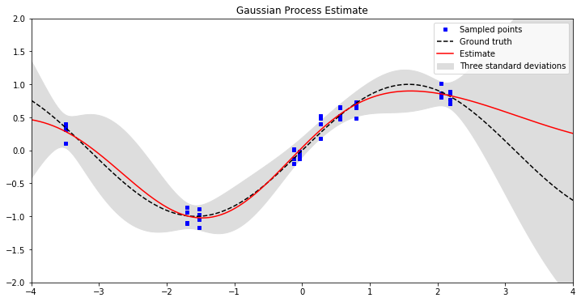

Gaussian Process
================

.. image:: https://travis-ci.com/anassinator/gp.svg?token=FyA1SHksnNkHz1euHTTi&branch=master
   :target: https://travis-ci.com/anassinator/gp

This is a *differentiable* `Gaussian Process
<https://en.wikipedia.org/wiki/Gaussian_process>`_ implementation for
`Theano <http://deeplearning.net/software/theano/>`_.

The code is based off of the
`Gaussian Processes for Machine Learning <http://www.gaussianprocess.org/gpml/>`_
book and supports both Python 2 and 3.

Install
-------

To install simply clone and run:

.. code-block:: bash

  python setup.py install

Usage
-----

After installation, :code:`import` and use as follows:

.. code-block:: python

  from gp import GaussianProcess

  gp = GaussianProcess()
  gp.fit(X, Y)

where :code:`X` and :code:`Y` are your training data's inputs and outputs as
:code:`theano.SharedVariable`.

You can then use the Gaussian Process's estimates as a tensor in your own
graphs:

.. code-block:: python

  mu = gp.mean
  sigma = gp.standard_deviation
  sigma_squared = gp.variance
  log_likelihood = gp.log_likelihood

You can also differentiate any of these tensors with respect to any other
tensor variables:

.. code-block:: python

  import theano.tensor as T

  loss = -gp.log_likelihood
  loss_wrt_hyperparameters = T.grad(loss, gp.hyperparameters)

Alternatively, you can use it standalone and compile its tensors into
functions:

.. code-block:: python

  gp.compile()
  mu = gp.compute_mean(x)
  sigma = gp.compute_standard_deviation(x)
  sigma_squared = gp.compute_variance(x)

The following is an example of what this Gaussian Process was able to estimate
with a few randomly sampled points (in blue) of a noisy :code:`sin` function.
The dotted lines represent the real function that was kept a secret from the
Gaussian Process, whereas the red line and the grey area represent the
estimated mean and uncertainty.

You can see the `examples <examples/>`_ directory for some
`Jupyter <https://jupyter.org>`_ notebooks with more detailed examples. You can
also play with the *secret* functions that the Gaussian Process is attempting
to learn and see how well it performs. Depending on the complexity and nature
of the function, you might need to sample more data or lower the noise applied
to the system.

Finally, you can also use a custom kernel function instead of the default
Radial-Basis Function (RBF) kernel by implementing your own :code:`Kernel`
class as in `kernel.py <gp/kernel.py>`_.

Contributing
------------

Contributions are welcome. Simply open an issue or pull request on the matter.

Linting
-------

We use `YAPF <https://github.com/google/yapf>`_ for all Python formatting
needs. You can auto-format your changes with the following command:

.. code-block:: bash

  yapf --recursive --in-place --parallel .

License
-------

See `LICENSE <LICENSE>`_.
